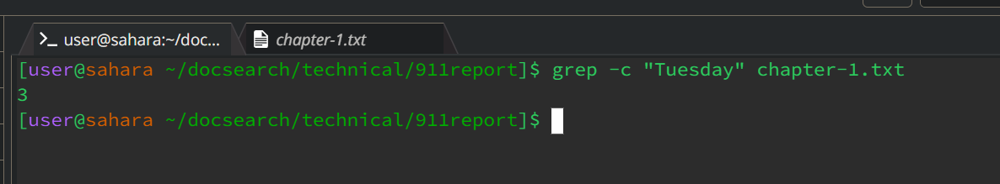

**PART: 1**
**A Failure**
```
  @Test
  public void averageWithoutLowestTest() {
    double[] input1 = {1, 2, 3, 10, 1};
    assertEquals(4.0, ArrayExamples.averageWithoutLowest(input1), 0.000001);
  }
```

**The Symptom**


**A test that doesn't break the code**

```
 @Test
    public void testAverageWihtoutLowest() {
      double[] input1 = {1,4,4,5};
      assertEquals(3.5, ArrayExamples.averageWithoutLowest(input1), 0.0001);
    }
```

**The Symptom**


**The function with the bug**

```
  static double averageWithoutLowest(double[] arr) {
    if(arr.length < 2) { return 0.0; }
    double lowest = arr[0];
    for(double num: arr) {
      if(num < lowest) { lowest = num; }
    }
    double sum = 0;
    for(double num: arr) {
      if(num != lowest) { sum += num; }
    }
    return sum / (arr.length - 1);
  }

```

**The corrected method**
```
  static double averageWithoutLowest(double[] arr) {
    if(arr.length < 2) { return 0.0; }
    double lowest = arr[0];
    for(double num: arr) {
      if(num < lowest) { lowest = num; }
    }
    double sum = 0;
    for(double num: arr) {
       sum += num; 
    }
    return (sum - lowest) / (arr.length - 1);
  }
```

The issue was when the array had matching lowest elements. For example, {4,3,2,2} calculating the sum of this array without the lowest should be 9 but the original code calculated 7. Because the code first calculates the lowest element, then the program does not add any element to the sum that equals the lowest When calculating the sum of the array. This is fine if the lowest element is unique, but not fine otherwise. My solution to this was to still calculate the lowest element, once that is done simply sum up all the elements (even the lowest). Now, before calculating the average the program will remove the lowest from the sum, Sum - lowest. This works because regardless of how many lowest elements there are one and only one is being removed from the sum, which gives us the desired behavior.

**PART: 2**
* Souce: 
[Link](https://www.geeksforgeeks.org/grep-command-in-unixlinux/#)

**grep Command**

* Example: 1

* grep -c

* File:


> What grep -c does is look through an entire file for a given string. The -c command will display the
> number of times that string appears in the given file. Perhaps this could be useful to check an essay
> paper to make sure you are not using a given word too much.

* Directory:


> Grep cannot be used directly on a directory. However, you can use grep on the contents of a whole
> directory When used on a directory you can check all such files and see how many times a string appears
> in each given .txt file within the directory.

* Example: 2

* grep -i

* File:


> When you use the command "grep" it looks for a given string char for char. However, with the -i add on
> you can ignore uppercase and lowercase as seen above. chapter-1.txt does not contain "tuesday"
> because the t is not capitalized within the quotes. Using -i we are able to match "tuesday" with
> "Tuesday".


* Directory:

 

> Similar to just a file when used on a directory of files you are able to check all files for said
> string, ignoring uppercase and lowercase. Pretty useful for checking code to make sure variable names
> are consistent throughout. by checking if (grep -i -c == grep -c) where they are both looking for the
> same variable name.

* Example: 3

* grep -l

* File:
 

> The -l command prints out the file path if the string is found in the file. Using this command on a file > directly is not very useful and is probably never used in this way.

* Directory:


>  The -l command becomes useful when used on a directory of files. Because you get a print of the file
>  paths to each file containing the string. Which is incredibly useful, imagine you are searching through
>  old public records for a person's name. With this command, you can get each file that has the name in
>  it.

* Example: 4

* grep -o

* File:
 

> The -o command is neat but does not seem all that useful. When grep finds a match for the string it will
> print that string which to me is no more useful than -c. Where -c prints the number of matches and we
> already know what the match is.

* Directory:

 

> When -o is used on a directory it searches the files and prints the path followed by the search string if found in that file. It is worth noting that we know Chapter-1.txt has 3 instances of "Tuesday" but when used with a Directory grep -i seems to only care if it can find one match, interesting.


