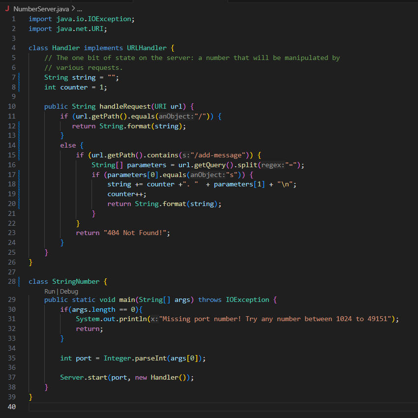
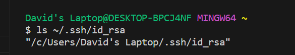
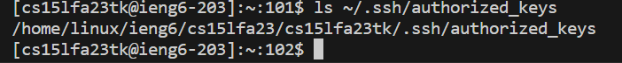
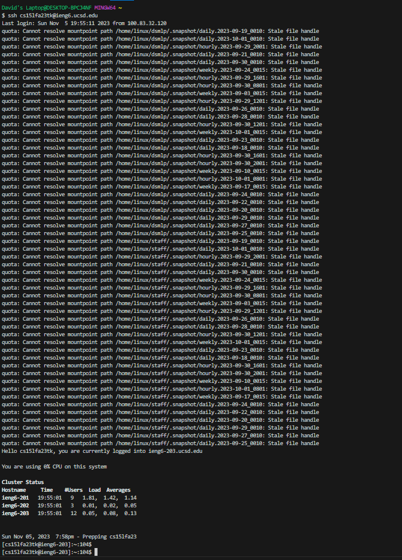

# CSE 15L Lab #2 Report | David Guido

* ServerCode

* Which methods in your code are called: HandlerRequest.

* What are the relevant arguments to those methods, and the values of any relevant fields of the class:
  The URL which is of type URI. The class has an Int and a String, the Int is to track when a string was added and the String is used to store 
  the added Strings.

* How do the values of any relevant fields of the class change from this specific request? If no values got changed, explain * why: Yes, the count gets incremented by 1 as it does with each call to HandleRequest. the string had the String "Hello" added which ultimately stores "1.  Hell\n" when the Method call is done. Additionally, within the method HnadleRequest there is a String array called parameters which is used to store information from the URL so we can perform queries and split functions on the URL which decides what gets stored in the string. The information in parameters is lost when HandleRequest ends.

* Which methods in your code are called: HandlerRequest.
  
* What are the relevant arguments to those methods, and the values of any relevant fields of the class:
  The URL which is of type URI. The class has Int and String, the Int is to track when a string was added and the String is used to store the 
  added Strings.
  
* How do the values of any relevant fields of the class change from this specific request? If no values got changed, explain why: Yes,
  the count will change to 2. The string will have "I hope this email finds you well" added which by the end of the method makes the string "1. 
  Hello\n2. I hope this email finds you well\n". Additionally, within the method HnadleRequest there is a String array called parameters which is used to store information from the URL so we can perform queries and split functions on the URL which decides what gets stored in the string. The information in parameters is lost when HandleRequest ends.

* The path to the private key for your SSH key for logging into ieng6 (on your computer or on the home directory of the lab computer)

* The path to the public key for your SSH key for logging into ieng6 (within your account on ieng6)

* A terminal interaction where you log into ieng6 with your course-specific account without being asked for a password.

 In a couple of sentences, describe something you learned from lab in week 2 or 3 that you didn’t know before. 
 I learned how the split() function works. I now understand how it finds s given char and then stores everything to the left of that charr in an array at index 0 and everything to the right of the char into the same array but in index 1.
