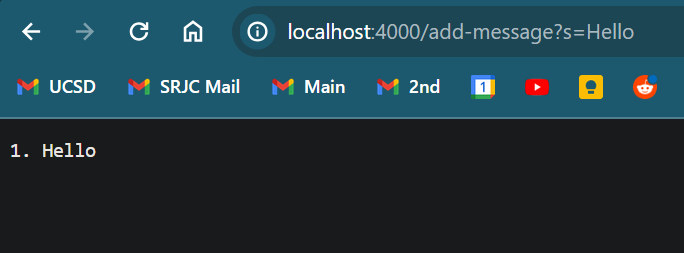

# CSE 15L Lab #2 Report | David Guido

 //chang ethis code
* ServerCode

* Which methods in your code are called: HandlerRequest

What are the relevant arguments to those methods, and the values of any relevant fields of the class:

How do the values of any relevant fields of the class change from this specific request? If no values got changed, explain why.

Which methods in your code are called?
What are the relevant arguments to those methods, and the values of any relevant fields of the class?
How do the values of any relevant fields of the class change from this specific request? If no values got changed, explain why.

part 3
In a couple of sentences, describe something you learned from lab in week 2 or 3 that you didn’t know before.
