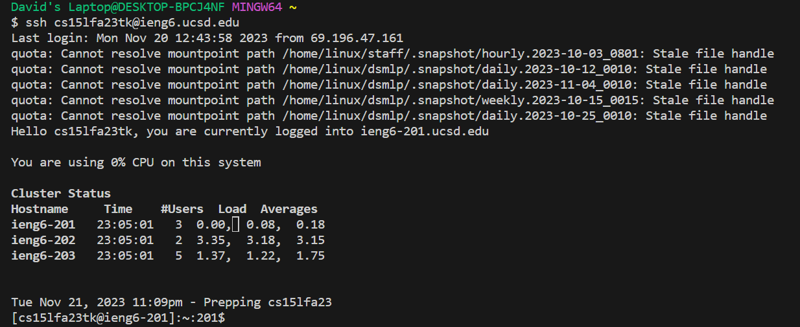
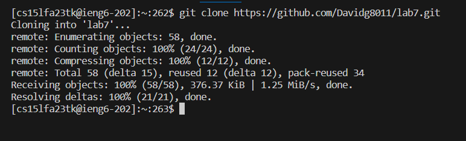
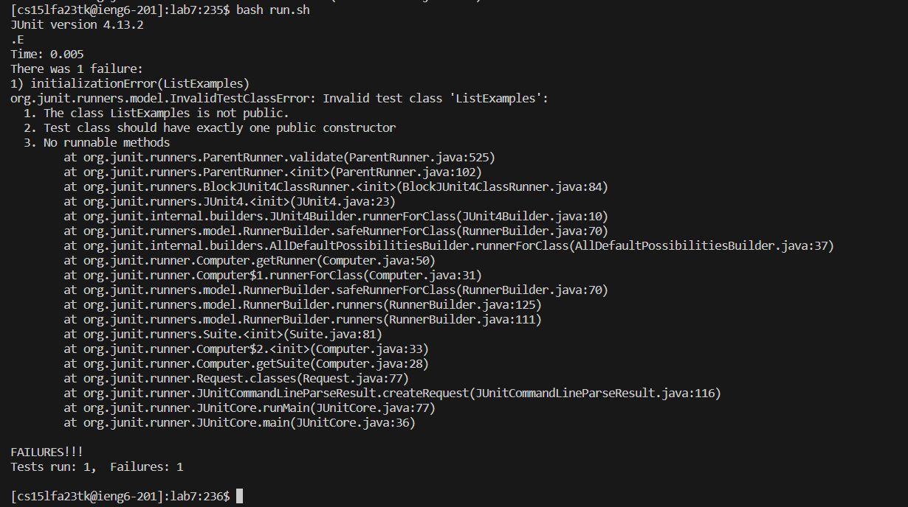
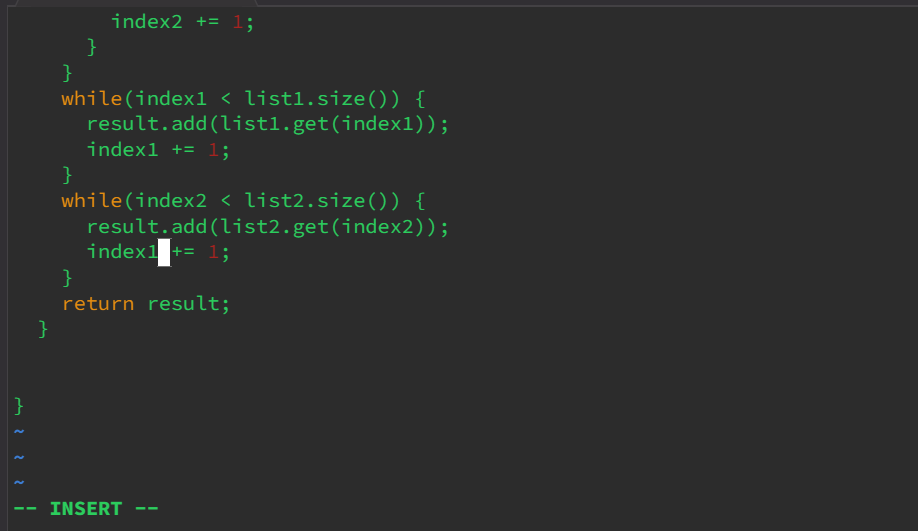
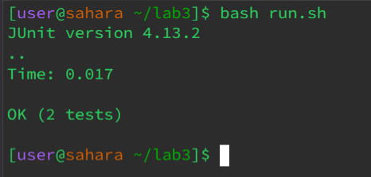
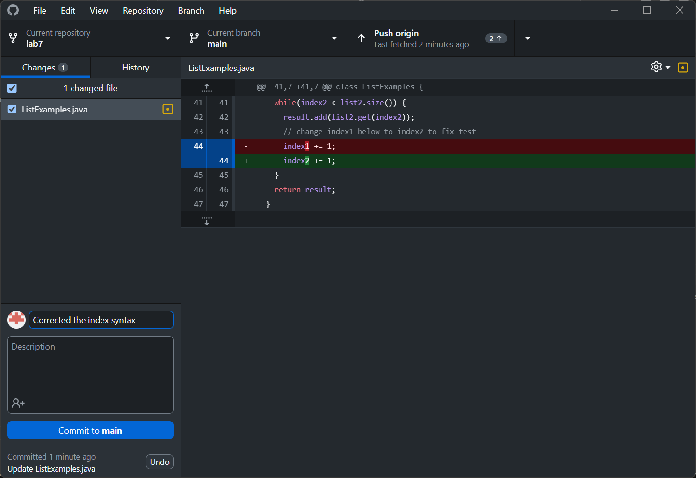

**LAB #4**

**4) Log into ieng6**

* Starting from the terminal:
* We log into the server by typing **ssh** space **cs15lfa23tk@ieng6.ucsd.edu** and hitting enter.

**5) Clone your fork of the repository from your Github account (using the SSH URL)**

* to clone the repository I typed: **git** space  **clone** space **https://github.com/ucsd-cse15l-s23/lab7** and hitting enter 

**6) Run the tests, demonstrating that they fail**

* to run the tests I typed: **ls** and hit enter, followed by **cd** space **l** tab and then hit enter.
* I now typed **vim** space **run.sh** and hit enter, to create a bash file so I can more easily the test in the future.
* Once in vim for run.sh I typed, **i** then typed **set** space **-e** followed by enter, enter, enter.
* I now tpyed, **javac** space **-cp** space **.:lib/hamcrest-core-1.3.jar:lib/junit-4.13.2.jar** space * *.java.
* lastly I typed, **java** space **-cp** space **.:lib/hamcrest-core-1.3.jar:lib/junit-4.13.2.jar** space
*  **org.junit.runner.JUnitCore** space **ListExamples** followed by pressing ecs then **:wq** whihc brings us back to the
*  terminal. Now we can finally run the test. Within the terminal I typed, **bash** space **run.sh** followed by enter.

**7) Edit the code file to fix the failing test**

To fix the code: From the terminal type, **vim** space, **shift+l** tab **.java** and enter. Now that are in vim type, **:44** and hit enter. Now type **ea** backspace **2** esc and **:wq**

**8) Run the tests, demonstrating that they now succeed**

* Now we can finally run the test. Within the terminal I typed, **bash** space **run.sh**
* followed by enter.

**9) Commit and push the resulting change to your Github account (you can pick any commit message!)**

* To commit these changes I used **alt** + **tab** to get to the github app, once there I pressed **tab** a bunch of times to get to the commit message box. I then typed **corrected** space **the** space **index** space **syntax**

