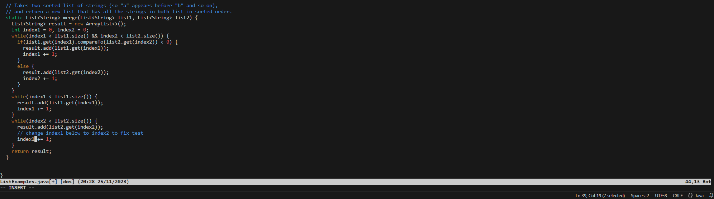
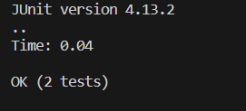

**LAB #4 David Guido**

**4) Log into ieng6**

* Starting from the terminal:
* We log into the server by typing **ssh** \<space\>  **cs15lfa23tk@ieng6.ucsd.edu** and hit \<enter\>
  

**5) Clone your fork of the repository from your GitHub account (using the SSH URL)**

* To clone the repository I typed: **git** \<space\>  **clone** \<space\> **git@github.com:Davidg8011/lab3.git** and hit \<enter\>

**6) Run the tests, demonstrating that they fail**

* From the terminal I typed **bash** \<space\> **test.sh** and hit \<enter\> to run the Junit tests.

**7) Edit the code file to fix the failing test**

* To fix the code: From the terminal I typed **vim** \<space\>, **shift+l** \<tab\> **.java**, and hit
* \<enter\>. Now that I am in vim I type, **:44** (goes to line 44) and hit \<enter\>, followed by **ea**
* (e goes to the end of the word, a moves cursor to the right one and enters insert mode). Now I typed
* \<backspace\> **2** \<esc\> and **:wq** (wq to write and quit vim) and hit \<enter\>

**8) Run the tests, demonstrating that they now succeed**

* Now we can finally run the tests again to show the code is working as expected. Within the terminal I
* typed, **bash** \<space\> **run.sh**
* followed by \<enter\>.

**9) Commit and push the resulting change to your Github account (you can pick any commit message!)**

* To commit these changes I used \<alt\> + \<tab\> to get to the GitHub app, once there I pressed \<tab\> 9
* times to get to the commit message box. I then typed **corrected** \<space\> **the** \<space\> **index**
* \<space\> **syntax** and hit \<tab\> 3 times to select the "commit to main" box, once there I hit
* \<enter\> to commit the changess. Lastly, I hit \<tab\> 5 times to select the "push to origin" box and hit
* \<enter\>

