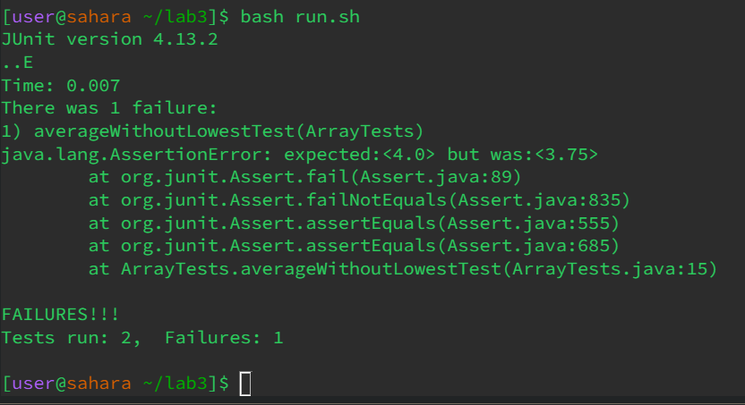

**LAB #4**

**4) Log into ieng6**

* Starting from the terminal:
* We log into the server by typing **ssh** space **cs15lfa23tk@ieng6.ucsd.edu** and hitting enter.

**5) Clone your fork of the repository from your Github account (using the SSH URL)**

* to clone the repository I typed: **git** space  **clone** space **https://github.com/ucsd-cse15l-s23/lab7** and hitting enter 

**6) Run the tests, demonstrating that they fail**

* to run the tests I typed: **ls** and hit enter, followed by **cd** space **l** tab and then hit enter.
* I now typed **vim** space **run.sh** and hit enter, to create a bash file so I can more easily the test in the future.
* Once in vim for run.sh I typed, **i** then typed **set** space **-e** followed by enter, enter, enter.
* I now tpyed, **javac** space **-cp** space **.:lib/hamcrest-core-1.3.jar:lib/junit-4.13.2.jar** space * *.java.
* lastly I typed, **java** space **-cp** space **.:lib/hamcrest-core-1.3.jar:lib/junit-4.13.2.jar** space **org.junit.runner.JUnitCore** space **ListExamples** followed by pressing ecs then **:wq** whihc brings us back to the terminal.
* Now we can finally run the test. Within the terminal I typed, 

**7) Edit the code file to fix the failing test**
**8) Run the tests, demonstrating that they now succeed**
**9) Commit and push the resulting change to your Github account (you can pick any commit message!)**



```
 @Test
    public void testAverageWihtoutLowest() {
      double[] input1 = {1,4,5,6};
      assertEquals(5.0, ArrayExamples.averageWithoutLowest(input1), 0.0001);
    }
```
