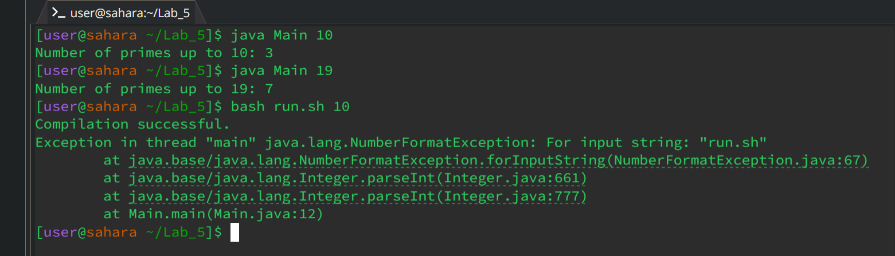
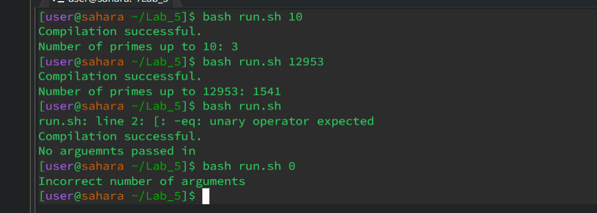
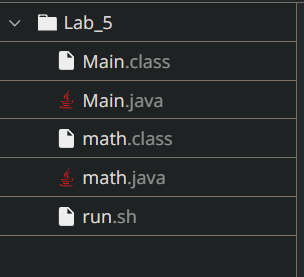

**LAB #5 David Guido**


1) The original post from a student with a screenshot showing a symptom and a description of a guess at the bug/some sense of what the failure-inducing input is. (Don’t actually make the post! Just write the content that would go in such a post)

**Student Post**

* Hello, 
*
* I am having trouble debugging my code. The code can run from the terminal when I type "Javac Main.java"
* followed by java Main 15. However, I cannot get the code to run from a bash script file.
* This makes me think the issue must be with the bash file.




2) A response from a TA asking a leading question or suggesting a command to try (To be clear, you are mimicking a TA here.)


**TA Response**

* Hello,

* Looks like you're most of the way there! just a few issues left, I noticed that the total number of primes seems to be off by 1 can you send me a screenshot of your method that calculates if a number is prime or not? Going back to your bash script it seems the way you're handling the input seems to be funky. Remember that values passed into bash are accessed using $1, $2 etc. So you .sh file should have a line that reads "Java Main $1" 

Lmk if that helps any!


3) Another screenshot/terminal output showing what information the student got from trying that, and a clear description of what the bug is.

**Student**

* That worked! Using $1 I was finally able to get the passed-in value when using a bash script.
* I got some issues when calling run.sh without a value which I am fine with but when I call run.sh while
* passing 0 in I get weird symptoms. My goal was to treat 0 like any other number with my code



* Below is my code to check if something is prime
```
   public static boolean isPrime(int number) {
        if (number <= 1) {
            return false;
        }

        if (number % 2 == 0) {
            return false;
        }

        for (int i = 2; i <= Math.sqrt(number); i++) {
            if (number % i == 0) {
                return false;
            }
        }
        return true;
    }
}
```

**TA Response**

* Looking at your isPrime() method I see you're checking if the number is divisible by 2 and returning false if it
* is. This is a clever check but there is an edge case when the number is 2. 2 is prime and should return true but
* with your code the number 2 returns false which is why your number of prime numbers is off by one.
* Looking at your terminal I see you have a check of sorts on line 2 of your run.sh file I would double, triple-
* check that the line is free from any logic or syntax errors.


**Student Post**

* Yep, I had issues with line 2 in run.sh Thanks for the help.


5) At the end, all the information needed about the setup including:
   
a) The file & directory structure needed

**The file & directory structure**   



b) The contents of each file before fixing the bug

**The contents of each file before fixing the bug**

**run.sh**

```
if [ $1 -eq 0 ]; then
    echo "Incorrect number of arguments"
    exit
fi


javac Main.java


if [ $? -eq 0 ]; then
    echo "Compilation successful."

    java Main $0

else
    echo "Main.java did not compile"
fi
```

**Main.java**

```

public class Main {

    public static void main(String[] args) {
        // 2nd check to see if no arguemnts were passed in
        if (args.length != 1) {
            System.out.println("No arguemnts passed in");
            System.exit(1);
        }

        // get the first argument passed in and store it in limit
        int limit = Integer.parseInt(args[0]);

        // create a new math Instance
        math mathInstance = new math();
        
    
        int result = mathInstance.countPrimesUpTo(limit);
        System.out.println("Number of primes up to " + limit + ": " + result);
    }
}

```

**math.java**

```
import java.lang.Math;

public class math {

    public static int countPrimesUpTo(int limit) {
        int count = 0;
        for (int i = 2; i <= limit; i++) {
            if (isPrime(i)) {
                count++;
            }
        }
        return count;
    }

    public static boolean isPrime(int number) {
        if (number <= 1) {
            return false;
        }

        if (number % 2 == 0) {
            return false;
        }

        for (int i = 2; i <= Math.sqrt(number); i++) {
            if (number % i == 0) {
                return false;
            }
        }
        return true;
    }
}

```

c) The full command line (or lines) you ran to trigger the bug
Copy these from the picture

**list of commands**

* to trigger the bug we ran:
> bash run.sh 10


* later on we ran:
> bash run.sh 10
> bash run.sh 12953
> bash run.sh
> bash run.sh 0


d) A description of what to edit to fix the bug

**orginial math.java**
```
  if (number % 2 == 0) {
      return false;
  }
```
> kept the clever trick of not checking even numbers but now checks if the number is 2 before returning false.

**Fixed**
```
if (number % 2 == 0 && number != 2) {
         return false;
     }
```


**Original run.sh**
```
if [ $? -eq 0 ]; then
    echo "Compilation successful."

    java Main $2
```

> $2 takes the 2nd passed in argument but our program only needs one which is simply $1.

**Fixed**
```
if [ $? -eq 0 ]; then
    echo "Compilation successful."

    java Main $1
```


**Original run.sh**
```
if [ $1 -eq 0 ]; then
    echo "Incorrect number of arguments"
    exit
fi
```
> Instead of $1 which is the first input from the user we want $# which is the number of inputs.

**Fixed**
```
if [ $# -eq 0 ]; then
    echo "Incorrect number of arguments"
    exit
fi
```


