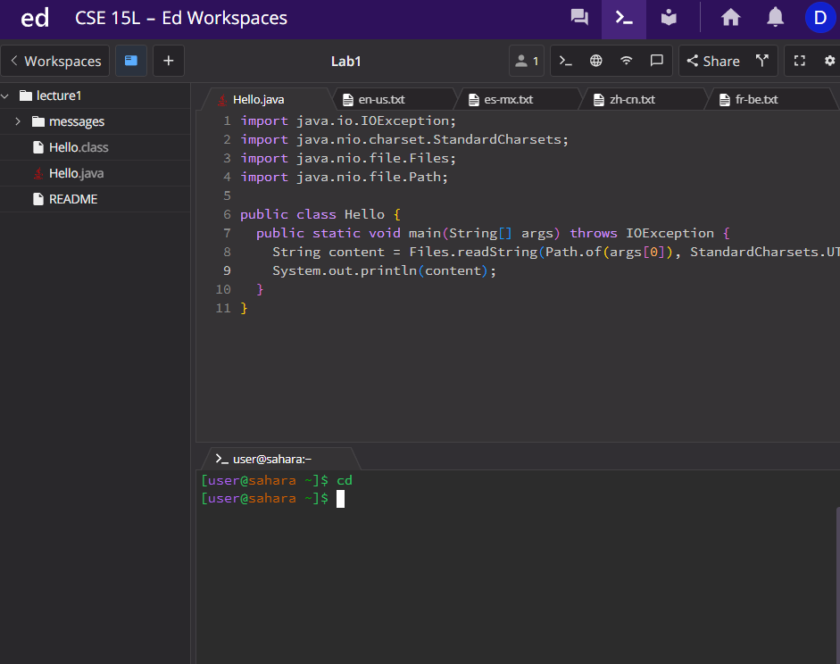
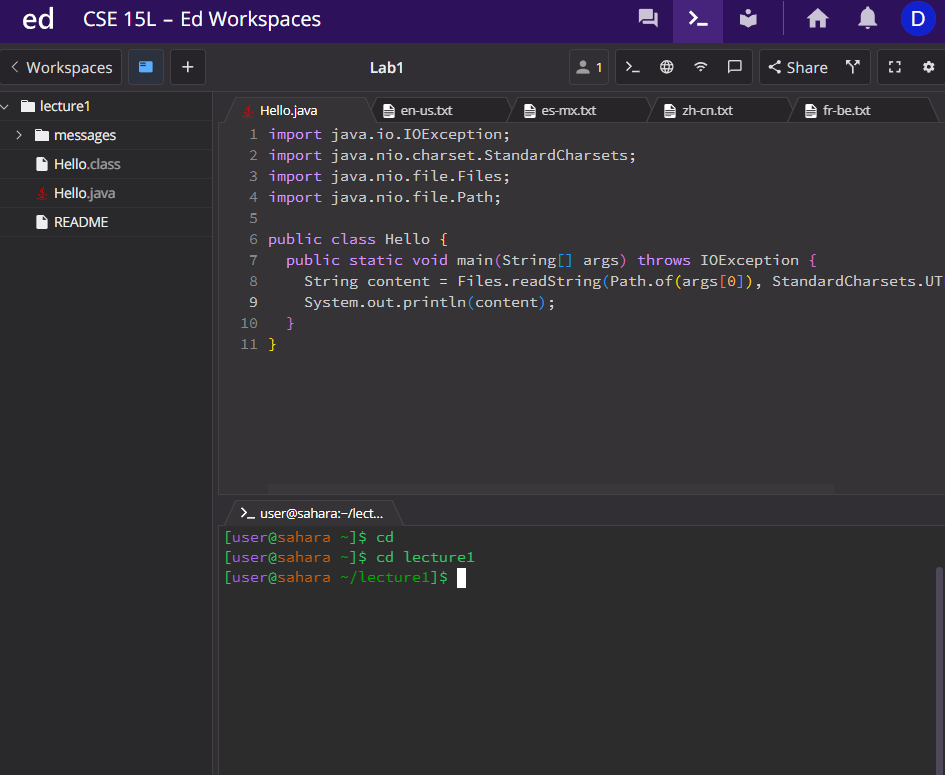
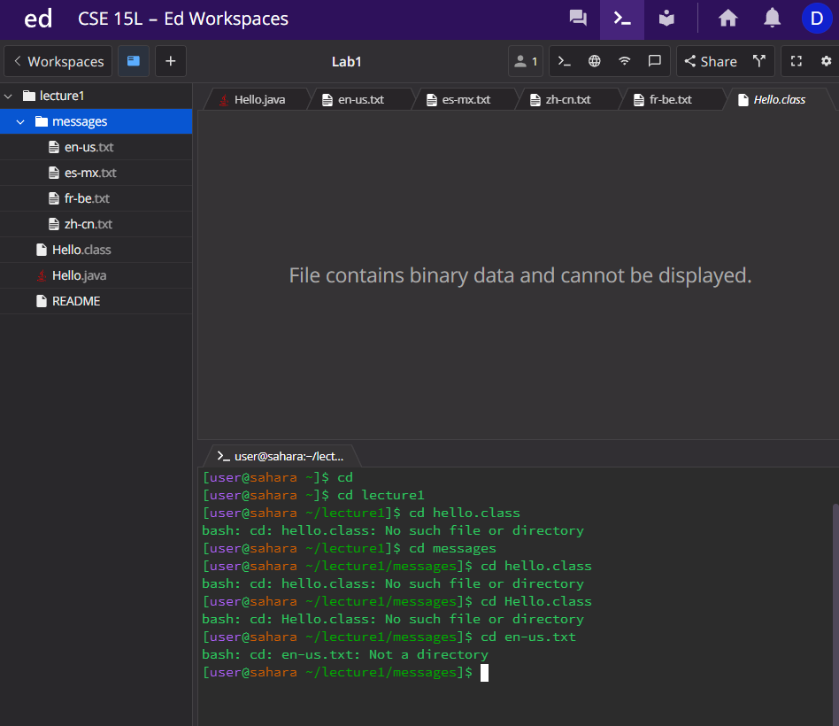
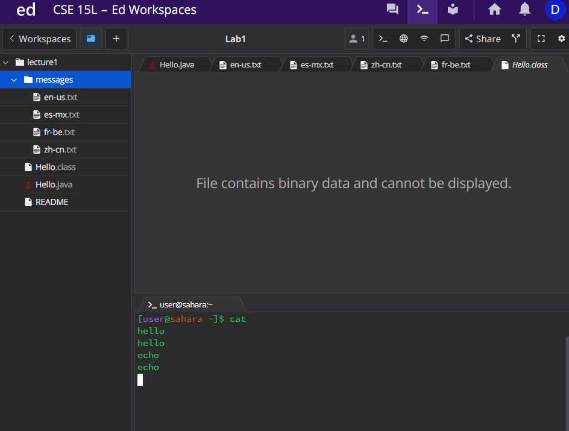
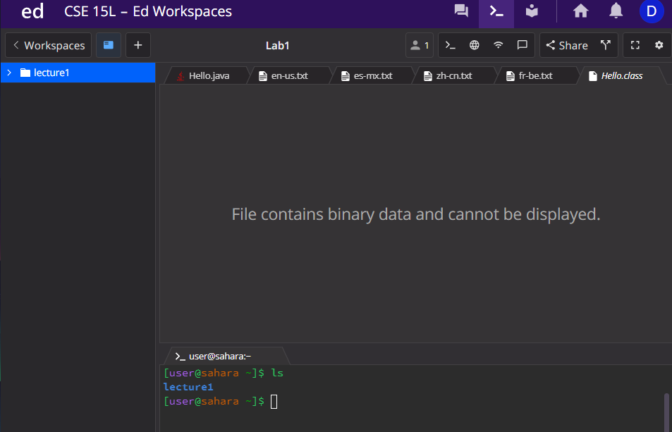
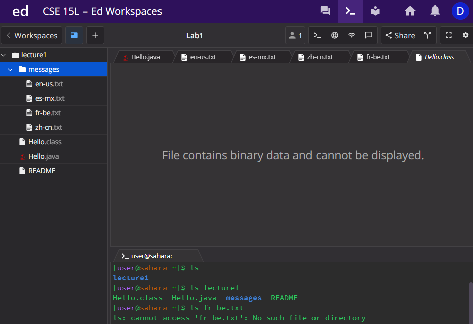

# CSE 15L Lab #1 Report | David Guido

* Using change directry with no auguement appears to have no effect on the current state of the terminal. 
---

* CD with the arument being a valid directy moves into that directy and beomes the current working directry 
---

* When the argument is a file that is not in the current directry you get the following messeage "No such file or directory"
* When using the CD command for a file that is in the current directory you get the message "Not a directory"
* Which makes sense that the change directory cammond is only for directories
---

* The cat command with no argument appears to do nothing at first.
* However, when you type something into the terminal it will echno the same thing back at you as seen in the picture above
---

* The cat command with the argument being a directory will output to the user saying that it is indeed a directory
---

* Using cat on a file that is not in the current directory will promnt the message "No such file or directory".
* When the argument for cat is a file and also in the current working directory, cat will display the infomarion within that file. Well, it does when the file is .txt I am unsure of other file types
---

* ls displays the all the directories or files that are within the current directory.
* Which checks out that we only see "lecture1" because we have no other file in EDstem then "lecture1"
---

* ls with the argument being lecture1 we get to see any other directory or file within lecture1
---

* ls used with a argument that is a file does not seem to be useful
* ls is used to see where you can go and once you know what you want to view that is when you use the cat command
---

